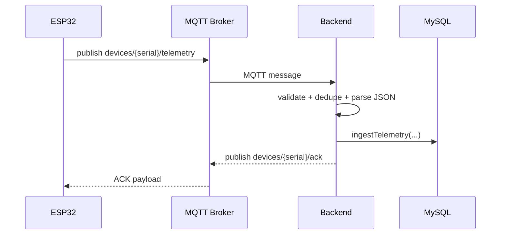
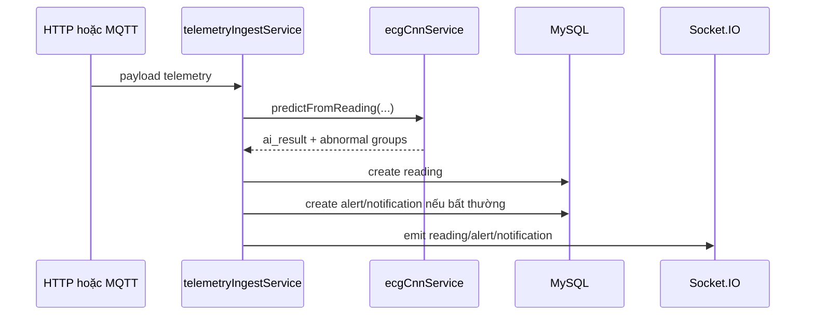
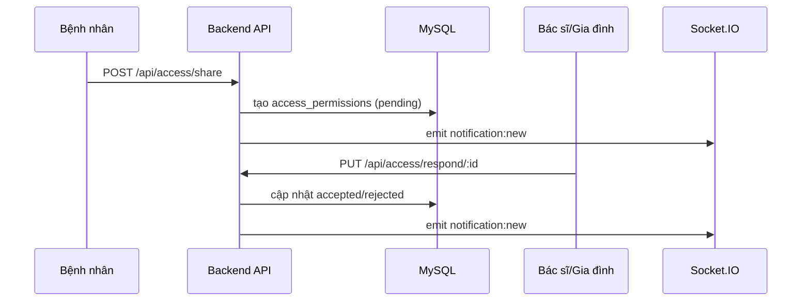

# Backend - Hướng dẫn đọc hiểu nhanh

Tài liệu này giúp thành viên mới nắm nhanh backend hiện tại của Ironman Holter

## Tổng quan
- **Stack chính**: `Node.js` + `Express` + `Prisma` + `MySQL` + `Socket.IO`.
- **Kênh ingest telemetry**: hỗ trợ cả **HTTP** và **MQTT**.
- **AI ECG**: dùng mô hình **CNN thật** chạy trên backend qua `TensorFlow.js`, có fallback an toàn khi inference lỗi hoặc tín hiệu không đủ điều kiện.
- **Realtime**: dùng `Socket.IO` để đẩy reading, alert, notification và chat event về frontend.
- **Vai trò hệ thống**: bệnh nhân, bác sĩ, gia đình, admin.

## Mục tiêu của backend
Backend chịu trách nhiệm cho toàn bộ vòng đời dữ liệu tim mạch:
1. Nhận telemetry từ thiết bị.
2. Chuẩn hóa và kiểm tra dữ liệu đầu vào.
3. Gọi AI để phân tích tín hiệu ECG.
4. Lưu reading / alert / notification vào database.
5. Phát sự kiện realtime đến đúng người dùng liên quan.
6. Hỗ trợ các tính năng ứng dụng như auth, chia sẻ quyền, bệnh sử, báo cáo, chatbot và direct message.

## Cấu trúc thư mục quan trọng
- `server/server.js`: entrypoint của backend, khởi tạo Express, Socket.IO, MQTT foundation, route và graceful shutdown.
- `server/prisma/schema.prisma`: schema Prisma map trực tiếp với MySQL hiện tại.
- `server/prismaClient.js`: khởi tạo Prisma Client.
- `server/routes/`: định nghĩa API endpoints.
- `server/controllers/`: xử lý request/response cho từng nhóm nghiệp vụ.
- `server/services/telemetryIngestService.js`: lõi ingest telemetry dùng chung cho cả HTTP và MQTT.
- `server/services/mqttTelemetryService.js`: kết nối MQTT, subscribe telemetry, publish ACK, dedupe TTL, lifecycle log.
- `server/services/ecgCnnService.js`: load model CNN, preprocess, infer, fallback và summarize kết quả AI.
- `server/services/notificationService.js`: tạo notification DB và emit realtime.
- `server/services/socketService.js`: quản lý kết nối Socket.IO, room và một số event realtime cũ.
- `server/services/socketEmitService.js`: helper emit event theo danh sách user.
- `server/utils/enumMappings.js`: map giữa enum Prisma và giá trị tiếng Việt trong DB.
- `server/prisma/seed.js`: seed dữ liệu ban đầu.

## Cấu hình môi trường
Backend đọc env theo thứ tự:
1. `server/.env`
2. `../.env` chỉ để bổ sung key còn thiếu, không override key đã có trong `server/.env`

Các biến quan trọng:
- `DATABASE_URL` hoặc bộ `DB_HOST`, `DB_PORT`, `DB_USER`, `DB_PASS`, `DB_NAME`
- `JWT_SECRET`
- `GEMINI_API_KEY`
- `PORT`, `CLIENT_URL`
- `MQTT_ENABLE`
- `MQTT_BROKER_URL`
- `MQTT_USERNAME`, `MQTT_PASSWORD`, `MQTT_CLIENT_ID`
- `MQTT_TOPIC_TELEMETRY`
- `MQTT_TOPIC_ACK_TEMPLATE`
- `MQTT_QOS`, `MQTT_ACK_ENABLE`
- `MQTT_MAX_INFLIGHT`
- `MQTT_DEDUPE_TTL_MS`
- `MQTT_DEDUPE_CLEANUP_INTERVAL_MS`
- `MQTT_MAX_PAYLOAD_BYTES`

## Luồng dữ liệu chính
### 1) Telemetry qua HTTP
- Endpoint: `POST /api/readings/telemetry`
- Controller: `server/controllers/readingController.js`
- Core business: `server/services/telemetryIngestService.js`
- Flow:
  - nhận payload từ thiết bị hoặc nguồn test
  - chuẩn hóa tín hiệu ECG và heart rate
  - infer AI qua `ecgCnnService`
  - lưu `reading`
  - tạo `alert` và `notification` nếu bất thường
  - emit realtime cho các user liên quan

### 2) Telemetry qua MQTT
- MQTT subscriber được khởi tạo trong `server/server.js` qua `initMqttTelemetry(...)`
- Topic uplink mặc định: `devices/+/telemetry`
- Topic ACK mặc định: `devices/{serial}/ack`
- Có các cơ chế quan trọng:
  - validate topic/payload serial
  - guard kích thước payload
  - parse JSON an toàn
  - dedupe theo `serial + message_id`
  - ACK success / duplicate / error về lại thiết bị
- MQTT ingest cuối cùng cũng đi vào cùng lõi business `ingestTelemetry(...)` với HTTP.

### 3) AI ECG
- AI không còn là mock trong luồng chính.
- `server/services/ecgCnnService.js` thực hiện:
  - preprocess tín hiệu
  - detect peak / cắt beat
  - chạy model TFJS CNN
  - hậu xử lý kết quả
  - fallback an toàn nếu input quá ngắn, lỗi model hoặc infer lỗi
- `telemetryIngestService.js` dùng kết quả AI để:
  - set `abnormal_detected`
  - tạo `ai_result`
  - tạo alert/notification khi cần

### 4) Notification và realtime
- Notification DB được tạo qua `notificationService`.
- Socket event được emit đến đúng người nhận qua `socketEmitService`.
- Backend có cả:
  - notification kiểu cảnh báo AI
  - yêu cầu chia sẻ quyền
  - phản hồi chia sẻ quyền
  - direct message

### 5) Chatbot và direct message
- `POST /api/chat`: chat với Gemini.
- `GET /api/chat/history`: lịch sử chat AI.
- `GET /api/chat/contacts`: danh sách contact direct chat.
- `GET /api/chat/direct/:other_user_id`: lịch sử direct message.
- `POST /api/chat/direct`: gửi direct message.
- `PUT /api/chat/direct/:other_user_id/read`: đánh dấu đã đọc.

## Endpoint đặc biệt
- `GET /api/hello`
  - dùng để wake-up backend và database khi hạ tầng ngủ.
  - endpoint này thực hiện một query đơn giản tới DB (`SELECT 1`).

## Realtime (Socket.IO)
Các room/event đang dùng hoặc được hỗ trợ trong code:
- `join-user-room`
- `join-role-room`
- `join-device-room`
- `request-ecg-data`
- `stop-ecg-stream`
- `send-chat-message`
- `emergency-alert`

Các event backend/frontend thường dùng:
- `reading-update`
- `alert`
- `notification:new`
- `ecg-data`
- một số event cũ trong `socketService` vẫn còn để hỗ trợ luồng realtime legacy

## Data model (tóm tắt đúng theo Prisma hiện tại)
- **User**: tài khoản, vai trò, trạng thái hoạt động.
- **Device**: thiết bị gắn với bệnh nhân, có `serial_number`, trạng thái hoạt động.
- **Reading**: dữ liệu ECG, `heart_rate`, `abnormal_detected`, `ai_result`.
- **Alert**: cảnh báo gắn với user và reading, có segment sample start/end.
- **Report**: báo cáo bác sĩ lập cho bệnh nhân.
- **ChatLog**: lịch sử chat với AI.
- **DirectMessage**: tin nhắn trực tiếp giữa người dùng.
- **AccessPermission**: chia sẻ quyền từ bệnh nhân sang bác sĩ/gia đình.
- **MedicalHistory**: bệnh sử, triệu chứng, thuốc, chẩn đoán AI/bác sĩ, soft delete.
- **Notification**: notification gốc.
- **NotificationRecipient**: người nhận notification và trạng thái đã đọc/chưa đọc.

## Các nhóm route chính
### Auth
- `POST /api/auth/register`
- `POST /api/auth/login`
- `GET /api/auth/me`

### Users
- `GET /api/users`
- `PUT /api/users/:id`
- `DELETE /api/users/:id`
- `PUT /api/users/change-password`

### Devices
- `POST /api/devices/register`
- `GET /api/devices/:user_id`
- `PUT /api/devices/:id/status`
- `GET /api/devices`

### Readings
- `POST /api/readings/telemetry`
- `POST /api/readings/fake`
- `GET /api/readings/detail/:reading_id`
- `GET /api/readings/:device_id`
- `GET /api/readings/history/:user_id`

### Alerts
- `POST /api/alerts`
- `GET /api/alerts/:user_id`
- `PUT /api/alerts/:id/resolve`
- `GET /api/alerts`

### Notifications
- `GET /api/notifications`
- `GET /api/notifications/unread-count`
- `PUT /api/notifications/read-all`
- `PUT /api/notifications/:notification_id/read`

### Reports
- `POST /api/reports/:user_id`
- `GET /api/reports/:user_id`
- `GET /api/reports/doctor/my-reports`

### Access
- `POST /api/access/share`
- `PUT /api/access/respond/:id`
- `GET /api/access/list/:patient_id`
- `DELETE /api/access/:id`
- `GET /api/access/pending`

### Medical history
- `GET /api/history/:user_id`
- `POST /api/history`
- `PUT /api/history/:id`
- `POST /api/history/:id/symptom`
- `PATCH /api/history/:id/ai`
- `DELETE /api/history/:id`

### Doctor / Family views
- `GET /api/doctor/patients/:viewer_id`
- `GET /api/doctor/history/:patient_id`
- `POST /api/doctor/history`
- `PUT /api/doctor/history/:id`
- `DELETE /api/doctor/history/:id`
- `GET /api/family/patients/:viewer_id`
- `GET /api/family/history/:patient_id`

### Chat
- `POST /api/chat`
- `GET /api/chat/history`
- `GET /api/chat/contacts`
- `GET /api/chat/direct/:other_user_id`
- `POST /api/chat/direct`
- `PUT /api/chat/direct/:other_user_id/read`

## Bảo mật và phân quyền
- `authenticateToken` **đã xác thực JWT thật**, không còn là stub.
- `authorizeRoles(...roles)` đang được dùng ở nhiều route admin / bác sĩ / bệnh nhân.
- Dữ liệu role trong DB được lưu bằng giá trị tiếng Việt, map qua enum Prisma bằng `enumMappings`.

## Lưu ý kỹ thuật quan trọng
- HTTP và MQTT cùng đi vào `telemetryIngestService`, giúp giữ một contract xử lý thống nhất.
- MQTT có ACK + dedupe in-memory, nhưng dedupe hiện không bền vững qua restart process.
- AI có fallback để không làm vỡ nghiệp vụ ingest nếu model hoặc tín hiệu gặp lỗi.
- `socketService` vẫn chứa một số luồng realtime legacy song song với `socketEmitService` mới hơn.
- Một số file backend vẫn còn comment tiếng Việt lỗi encoding ở vài nơi; không ảnh hưởng logic nhưng nên tiếp tục dọn.

## Chạy backend local
```bash
cd server
npm install
npm run dev
```

Nếu thay đổi Prisma schema hoặc client:
```bash
npx prisma generate
```

Nếu cần seed dữ liệu:
```bash
node prisma/seed.js
```

## Gợi ý kiểm thử nhanh
1. Tạo user và login để lấy JWT.
2. Đăng ký device cho bệnh nhân.
3. Gửi telemetry qua HTTP hoặc MQTT.
4. Kiểm tra DB có tạo `reading` / `alert` / `notification` hay không.
5. Mở frontend hoặc client Socket.IO để xác nhận event realtime.
6. Kiểm tra ACK MQTT nếu đang bật `MQTT_ENABLE=true`.

## Sequence ngắn gọn
### 1) MQTT telemetry -> ACK -> ingest


### 2) HTTP/MQTT telemetry -> AI -> alert -> notification


### 3) Chia sẻ quyền truy cập

